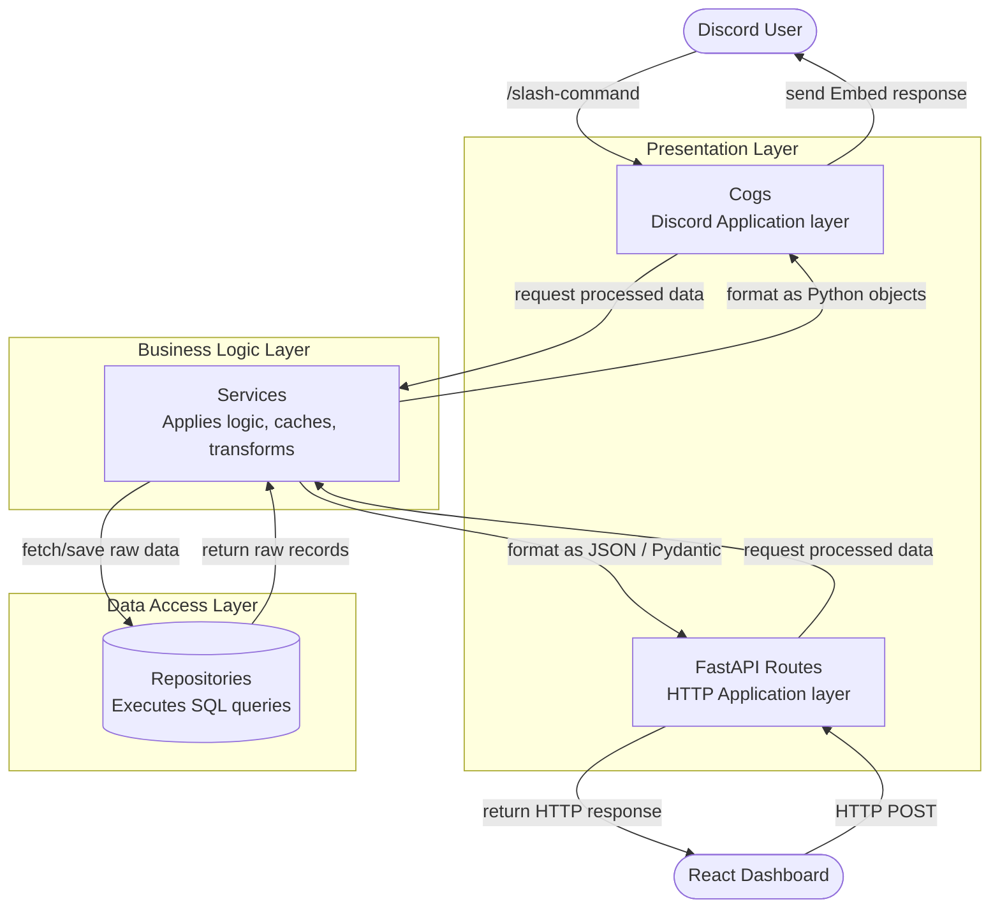

# Backend Architecture Pattern

The backend of the Rides Coordinator Bot strictly follows a layered architecture pattern: **Cogs -> Services -> Repositories**. This guarantees separation of concerns, ensures database access is isolated, and prevents Discord-specific logic from entering the business tier.

## 1. Cogs (`bot/cogs/`)
**Role:** The Presentation Layer (Discord Interface).
Cogs are responsible for interacting directly with Discord. This includes handling slash commands, listening to messages/reactions, and returning formatted replies or embeds to the user.

**Rules:**
- **DO NOT** write raw SQL or database queries here.
- **DO NOT** import repositories directly.
- **DO** inject the `commands.Bot` instance and initialize services.
- **DO** format messages and handle Discord HTTP errors.

## 2. Services (`bot/services/`)
**Role:** The Business Logic Layer.
Services act as the brains of the backend. They take requests from the Cogs (or FastAPI routes), perform necessary business validation, interact with third-party APIs or caching systems, and make calls to the Repositories to get or save data.

**Rules:**
- **DO NOT** send direct messages to Discord channels here (with rare exceptions like global error handlers).
- **DO** handle data transformations and validations.
- **DO** call functions from the `repositories` layer.

## 3. Repositories (`bot/repositories/`)
**Role:** The Data Access Layer.
Repositories are exclusively in charge of communicating with the SQLite database via SQLAlchemy (or directly via `aiosqlite` if raw queries are needed). Each file usually maps to a specific database table or domain logic.

**Rules:**
- **DO NOT** import Discord-specific objects (like `discord.Interaction` or `commands.Context`) here.
- **DO NOT** parse business logic; simply retrieve or store data as requested.
- **DO** manage the database sessions appropriately.

## Visual Flow Example

`User types /list-pickups` -> `Locations Cog (parses command)` -> `LocationsService (filters by day/cache)` -> `LocationsRepository (executes SQL to get data)` -> `LocationsService (formats raw data into a Python dict)` -> `Locations Cog (builds and sends the Discord Embed)`.

