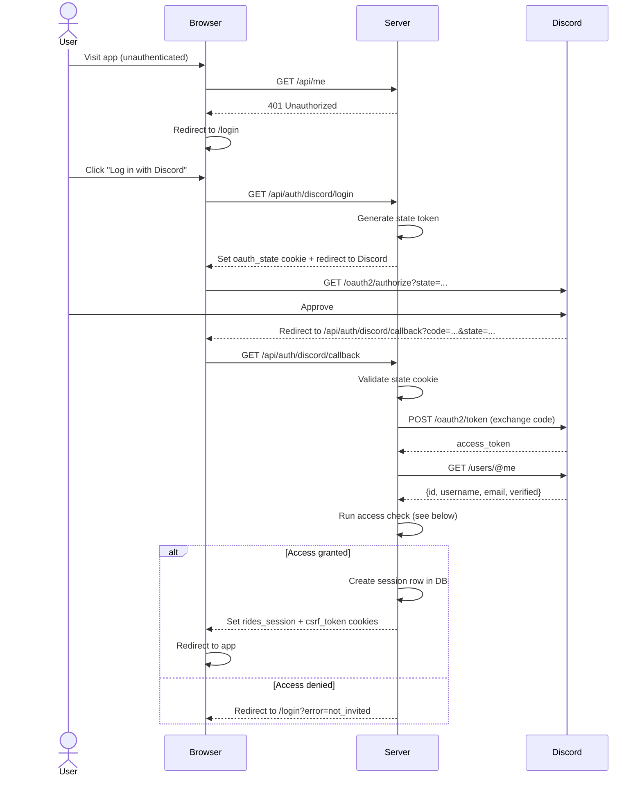
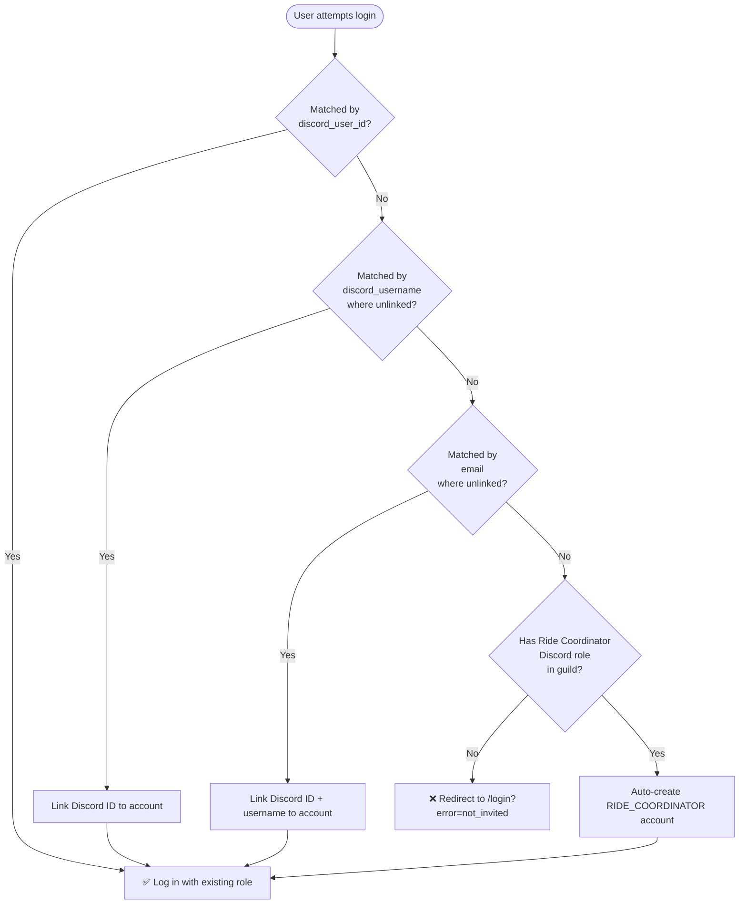

# Authentication

The app uses Discord OAuth2 for login. Auth is controlled by the `AUTH_PROVIDER` env var — set it to `cloudflare` to use the old Cloudflare Access setup, or `self` to use the self-hosted Discord OAuth flow described here.

---

## How login works



---

## Who gets access



Once a user's Discord ID is linked to their account (after first login), all future logins match on ID and skip the other checks.

---

## Roles

| Role | Access |
|---|---|
| `viewer` | Read-only — can view rides and pickups |
| `ride_coordinator` | Can manage rides and pickups |
| `admin` | Full access including user management |

Roles are stored in the `user_accounts` table. Admins can change roles from the **User Management** page.

---

## Inviting users

Admins can invite someone who doesn't have the Ride Coordinator Discord role:

1. Go to the **User Management** page.
2. Enter their Discord username (not display name — the unique `username` shown in Discord settings) and select a role.
3. Click **Invite**.

The invited user logs in normally via Discord. On their first login, the system matches their Discord username to the invite and links their account.

---

## First admin account

The first admin is seeded from the `ADMIN_EMAILS` env var. Set it to your email before the first deployment:

```
ADMIN_EMAILS=you@example.com
```

On startup, the app creates (or promotes) an account for that email. When you log in via Discord for the first time, your Discord identity is linked to it.

---

## Sessions

- Sessions are stored server-side in the `auth_sessions` table.
- The `rides_session` cookie holds a random token; only its SHA-256 hash is stored in the DB.
- Sessions expire after 30 days of inactivity (sliding window).
- Logging out deletes the session row immediately — the cookie cannot be reused.

---

## Required env vars

```bash
AUTH_PROVIDER=self

DISCORD_OAUTH_CLIENT_ID=        # From Discord developer portal
DISCORD_OAUTH_CLIENT_SECRET=    # From Discord developer portal
DISCORD_OAUTH_REDIRECT_URI=https://yourdomain/api/auth/discord/callback

FRONTEND_BASE_URL=https://yourdomain

# Optional — enables guild-role auto-provisioning
DISCORD_GUILD_ID=
DISCORD_RIDE_COORDINATOR_ROLE_ID=

# Seeds the first admin account
ADMIN_EMAILS=you@example.com
```

The redirect URI must be added verbatim to your Discord app under **OAuth2 → Redirects** in the [Discord developer portal](https://discord.com/developers/applications).

---

## Local development

By default (`APP_ENV=local`), all requests get a mock user (`dev@example.com`) with no Discord round-trip needed.

To test the real OAuth flow locally:

```bash
AUTH_PROVIDER=self
LOCAL_USE_DISCORD_OAUTH=true
DISCORD_OAUTH_CLIENT_ID=...
DISCORD_OAUTH_CLIENT_SECRET=...
DISCORD_OAUTH_REDIRECT_URI=http://localhost:8000/api/auth/discord/callback
FRONTEND_BASE_URL=http://localhost:5173
ADMIN_EMAILS=your-real@email.com
```

Add `http://localhost:8000/api/auth/discord/callback` to your Discord app's redirect URIs.
